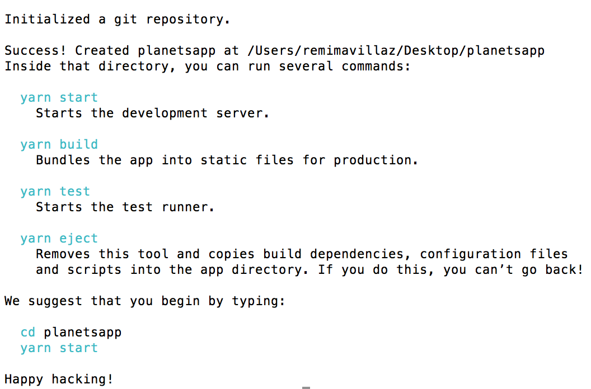

## Premiers pas

### Pré-requis

Avant d'installer une application React, il faut avoir NPM sur votre machine avec une version 5.2+ ainsi que Yarn. Ces 2 utilitaires vont permettre de gérer les dépendances de votre application.

Nous n'utiliserons pas Docker dans ce tutoriel.

Avant de passer à la suite, je vous conseille fortement d'aller lire [l'article de l'astronaute mehdi afin de maitriser tous les aspects de l'ES6](https://blog.eleven-labs.com/fr/lesnouveauteses6parti/) !

### Initialisation du projet

Nous allons créer une interface simple qui permet de visualiser 4 planetes avec la possibilité d'ajouter des astronautes à ces planètes.
Pour créer une nouveau projet react, nous allons utiliser la commande create-react-app suivante:

```js
npx create-react-app planetsapp
```

Cette commande va créer un nouveau projet React déjà configuré, vous n'avez pas besoin de configurer WebPack par exemple. Vous avez également a disposition, des librairies très utiles à React et des commandes qui vont lancer les tests. Plutôt pratique !
A la fin de l'installation, vous devriez avoir cela:



Comme indiqué, vous pouvez lancer l'application:

```js
cd planetsapp
yarn start
```

Allez sur http://localhost:3000/ depuis votre navigateur pour voir l'application, tout est prêt pour coder ! Le rechargement se fait automatiquement lorsque vous coder, plutot sympa !

### Architecture

Comme vu dans l'introduction, React est une librairie et non un framework, vous êtes totalement libre de créer les dossiers, les composants comme vous le souhaitez. Néanmoins, la communauté React ainsi que l'équipe React propose une architecture "standard" afin de s'y retrouver entre les projets.

Ouvrez votre meilleur IDE afin de visualiser l'architecture:


- node_modules: contient toutes les librairies que vous avez installé. ***Vous ne devez jamais touché à ce dossier.***
- public: contient le html de base ainsi que le favicon
- package.json: contient toutes les librairies et commandes disponibles
- src: c'est ici que vous allez coder. Le point d'entrée de votre application se situe dans `index.js`.

Il s'occupe de récuperer un élement React afin de l'afficher dans le DOM. Vous n'avez, pour l'instant, pas à toucher ce fichier. Vous pouvez éventuellement supprimer le code concernant le registerWorker, il n'est pas utile dans notre cas.

Le fichier `App.js` est le composant racine créé par le create-react-app, il s'agit d'un exemple et affiche le logo React sur l'interface.

C'est à partir d'ici que nous allons coder et c'est justement ce que nous allons faire dans notre prochaine étape ! Youhou !
