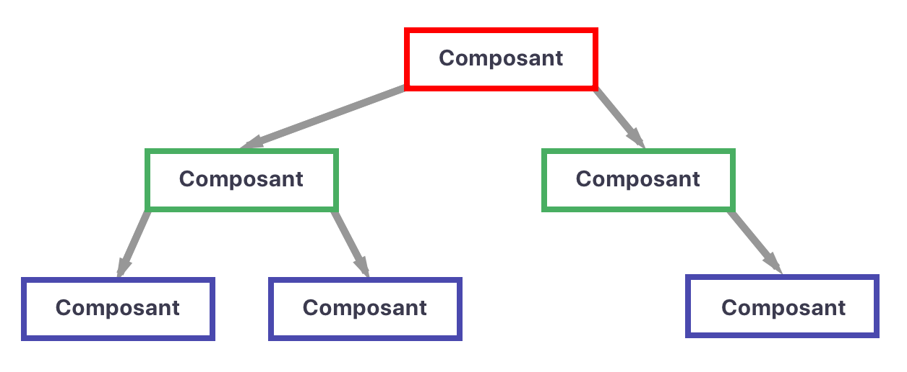
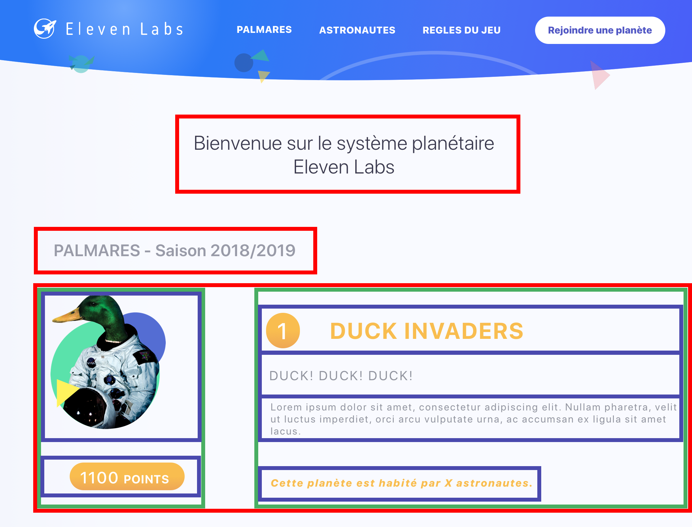
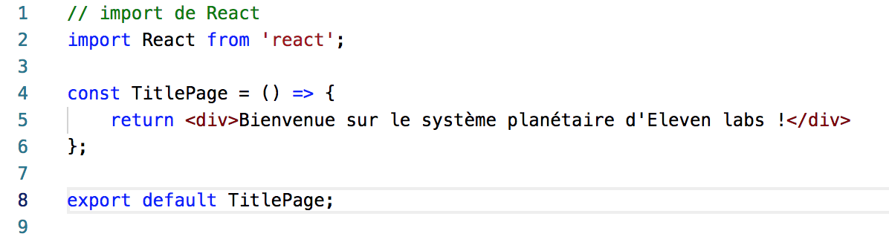
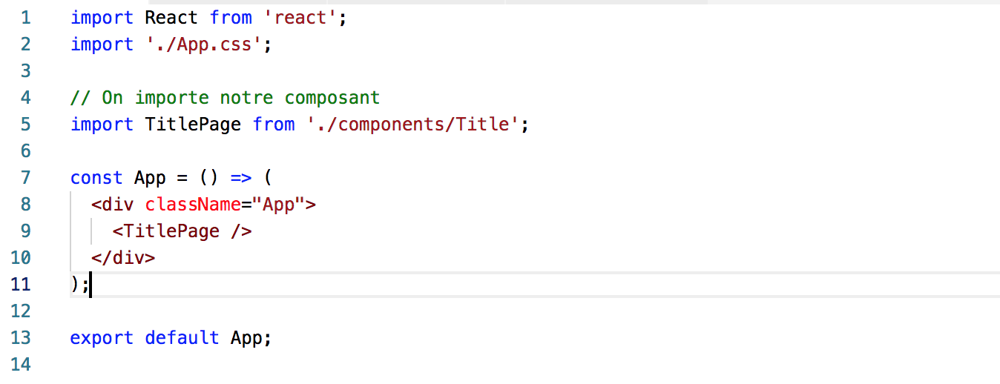

## Les composants React

### Définition

React permet de créer des composants, ce terme va donc revenir constamment et il est important de savoir de quoi il s'agit. Un composant est un élement de votre interface qui doit être indépendant et réutilisable.
Ainsi, plusieurs composants vont vous permettre de créer vos pages, un peu comme une arborescence !




### Découpage d'une page

Pour donner un exemple, nous allons découper une page qui affiche 1 planète avec sa description.



J'ai encadré tout ce qui peut potentiellement être un composant. par exemple le titre et le sous titre. La tâche est un peu compliqué lorsqu'il faut afficher les informations d'une planète.

Le premier composant (en rouge) est un layout, il est là principalement pour le style. Il contient 2 autres composants (en vert), le premier affichera l'image de la planète ainsi que ses points. Le 2eme composant affichera toutes les infos de la planete (nom, citation, description, nombre d'astronautes).

Bien évidemment, les composants en vert peuvent aussi être découpés. Chaque composant (en bleu) s'occupera donc d'une seule information et sera totalement unitaire. Un composant bleu pourra très bien être réutilisé ailleurs sur la page.

il est très important de faire cette conception lorsque vous développez une application. Si vous avez une maquette, c'est parfait, sinon, vous ne devez pas hésiter à prendre une feuille, de dessiner grosso modo votre application et de la découper. Vous y verrez beaucoup plus clair pour coder !

React gère beaucoup plus facilement les petits composants et vous pourrez l'optimiser au mieux. Nous y reviendront un peu plus tard :)

### Premier composant

Vous attendiez cette étape avec impatience, mais nous y voilà enfin. Il est temps de coder notre premier composant !

Nos composants se trouveront dans le dossier `components` à la racine de `src`. Nous allons créer un fichier `Title.jsx` à l'intérieur.

Un fichier jsx? Kézako?

Le jsx est une extension de javascript et va permettre d'introduire des balises dans votre javascript. Avant, pour créer un élément React, il fallait utiliser la fonction suivante:

```js
React.createElement('button', ...children)
```

Avec le jsx:
```js
return <button>{children}</button>
```
Le jsx rend le code plus sympa à lire !

Retournons à notre fichier Title.jsx et insérez le code suivant:



Simple non? il s'agit d'une fonction javascript qui retourne un élément React. Pour l'afficher sur notre page, retournons dans `App.js` à la racine de `/src`.
 


J'en ai profité pour supprimer le code qui affiche le logo React, vous pouvez en faire de même ;)
Si vous allez sur votre navigateur, le titre doit s'afficher correctement. Bien joué !

### Les props

Vous l'avez surement constaté mais, le composant TitlePage est une fonction javascript et elle peut recevoir qu'un seul argument nommé `Props`. Ainsi, un composant parent peut injecter des données a ses composants enfants !
Lorsqu'un composant reçoit une props ou qu'elle est mise à jour, ***un nouveau rendu est effectué automatiquement***.

Dans notre cas, on a un composant TitlePage qui affiche le titre de la page, mais nous l'avons écrit directement dans le composant. Comme je l'ai expliqué au début, un composant doit être réutilisable, ce n'est pas le cas ici !

On va donc lui injecter une props pour que son affichage soit dynamique. 

```javascript
// TitlePage.jsx
const TitlePage = ({ title }) => {
    return <h1>{title}</h1>
};

// App.jsx
const App = () => (
  <div className="App">
    <TitlePage title="Bienvenue sur le système planétaire d'Eleven labs !" />
    <TitlePage title="Un 2ème titre" />
  </div>
);
```

J'ai utilisé la destructuration pour récupérer la propriété `title` de l'objet props et on l'affiche dans notre JSX. Notre composant est désormais réutilisable !

### Vérifier les props

Les props sont essentielles lorsque vous créez des composants, vous allez les utiliser énormément. Mais que se passe-t-il si on injecte pas la propriété `title` à notre composant?
Rien ne s'affichera, pire il peut potentiellement faire planter l'application ! Si le composant est dépendant d'une props, il se doit de gérer le cas où celui-ci est absent ***en plus de le notifier aux développeurs***.

Il y a plusieurs moyens de faire cela 
:
```jsx
// TitlePage.jsx
import { string } from 'prop-types';

const TitlePage = ({ title = "Titre par défaut" }) => {
    return <h1>{title}</h1>
};

// On définit les types
TitlePage.propTypes = {
  title: string.isRequired,
};

// On définit les valeurs par défaut
TitlePage.defaultProps = {
  title: 'Titre par défaut',
};
```

Il est possible lorsque l'on destructure les props, de mettre une valeur par défaut pour chaque à chaque propriété.

Il existe également les prop-types provenant de la librairie du même nom. En créant un composant TitlePage, on va pouvoir lui définir les types (fonction, array, string, objet, etc) de chaque props, et s'ils sont requis.
En cas d'oubli, une erreur apparaitra dans la console afin de notifier au développeur que le composant risque d'être instable.

***Cette vérification des props n'est pas obligatoire mais je vous conseille fortement de le faire à chaque création ou mise à jour de composant***. 


> Vous pouvez utiliser des alternatives plus poussées comme [Flow](https://flow.org/en/docs/react/) ou passer en [TypeScript](https://www.typescriptlang.org/). Elles permettent de générer des erreurs JS si les props ne sont pas utilisées correctement.


Maintenant que les props n'ont plus aucun secret pour vous, il est temps d'afficher les infos d'une planète !

---
Retrouvez le code de l'étape 2 sur mon [Github](https://github.com/KizeRemi/Tutoriel-react/tree/step-2).

---
