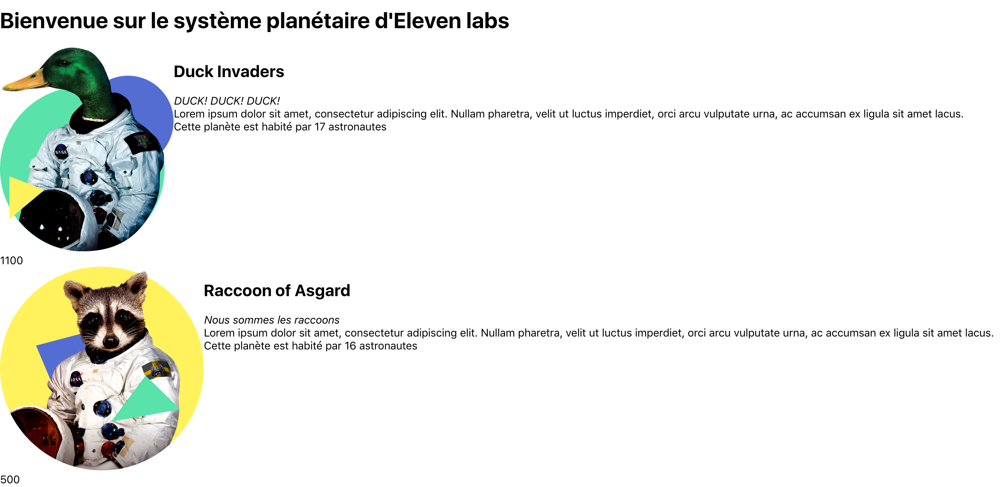

## Composant avancé: le container

### Affichage des informations

Il est désormais temps de passer a un composant plus compliqué: l'affichage de la planète et des ses informations. Si vous avez bien suivi, on va créer plusieurs composants dont un type de composant particulier: le ***container***.

### Création du composant Planet

Si vous vous souvenez, dans notre maquette, j'avais potentiellement découpé l'affichage de la planete en plusieurs composants.

On va, dans un premier temps, créer un composant Planet que l'on découpera par la suite. N'hésitez pas à faire un gros composant au départ si c'est plus simple, une fois qu'il est fonctionnel, vous pourrez le découper !

Tout d'abord, chaque planète a une image, je vous conseille de les ajouter dans `/src/assets/images`.

Puis, codons notre nouveau composant dans le fichier `Planet.jsx`

```js
import React from 'react';
// On importe notre image
import DuckImg from '../assets/images/Duck+triangles.png';

const Planet = () => (
  <div style={{ display: 'flex' }}>
    <div>
      </img>
      <div>1100 points</div>
    </div>
    <div>
      <h2>Duck Invaders</h2>
      <cite>DUCK! DUCK! DUCK!</cite>
      <div>
        Lorem ipsum dolor sit amet, consectetur adipiscing elit. Nullam pharetra, velit
        ut luctus imperdiet, orci arcu vulputate urna, ac accumsan ex ligula sit amet
        lacus.
      </div>
      <div>Cette planète est habité par 17 astronautes</div>
    </div>
  </div>
);

export default Planet;
```

Le principe est exactement le même que pour le composant Title mais avec un peu plus d'infos. Si vous avez bien suivi ce cours, vous devriez vous dire que l'on ne doit pas écrire les informations en dur car le composant n'est pas réutilisable... et vous avez raison !

```js
// Planet.js

// ce composant reçoit désormais un objet planet
const Planet = ({ planet }) => (
  <div style={{ display: 'flex' }}>
    <div>
      </img>
      <div>{planet.points}</div>
    </div>
    <div>
      <h2>{planet.name}</h2>
      <cite>{planet.citation}</cite>
      <div>
        {planet.description}
      </div>
      <div>{`Cette planète est habité par ${planet.totalAstronauts} astronautes`}</div>
    </div>
  </div>
);

Planet.propTypes = {
  planet: shape({
    img: string.isRequired,
    points: number.isRequired,
    name: string.isRequired,
    citation: string.isRequired,
    description: string.isRequired,
    totalAstronauts: number.isRequired,
  }),
}
```

On oublie pas notre propType, qui spécifie bien que le composant attend un objet contenant les 6 propriétés décrites ! Elles sont toutes obligatoires.

```js
// App.js
import Planet from './components/Planet';
import DuckImg from './assets/images/Duck+triangles.png';

const App = () => {
  const planet = {
    img: DuckImg,
    points: 1100,
    name: 'Duck Invaders',
    citation: 'DUCK! DUCK! DUCK!',
    description: 'Lorem ipsum dolor sit amet, consectetur adipiscing elit. Nullam pharetra, velit ut luctus imperdiet, orci arcu vulputate urna, ac accumsan ex ligula sit amet lacus.',
    totalAstronauts: 17,
  }

  return (
    <div className="App">
      <TitlePage title="Bienvenue sur le système planétaire d'Eleven labs" />
      {/* On injecte la planète en props */}
      <Planet planet={planet} />
    </div>
  )
};
```

Notre fichier `App.js` est également modifier pour récupérer la planète, importer l'image, et bien le composant Planet.
Si vous vous souvenez au départ, je vous ai parlé de Container et bien c'est justement ce qu'on a fait avec notre App.js !

On a créé ici 2 types de composants:
- Le component qui s'occupe uniquement d'afficher des données de manière structurées, avec éventuellement des animations.
- Le container, qui s'occupe de récupérer des informations (via une API par exemple), de les traiter et d'injecter les données aux components !

Il s'agit d'une architecture classique en React, ces composants sont souvents stockés dans les dossiers components et containers.

### Liste de composants !

Dans notre système planètaire, il est sensé y avoir plusieurs planètes. 
Comment peut-on faire? On peut créer 4 variables `planet` et mettre 4 composants <Planet /> à la suite... pas terrible.

On va plutot créer une liste de planètes, les listes sont courantes et React gère parfaitement ça ! Allons-y.

```js
// App.js
import RaccoonImg from './assets/images/Raccoon+triangles.png';

const App = () => {
  // On a un tableau de planètes
  const planets = [
    {
      id: 1,
      img: DuckImg,
      points: 1100,
      name: 'Duck Invaders',
      citation: 'DUCK! DUCK! DUCK!',
      description: 'Lorem ipsum dolor sit amet, consectetur adipiscing elit. Nullam pharetra, velit ut luctus imperdiet, orci arcu vulputate urna, ac accumsan ex ligula sit amet lacus.',
      totalAstronauts: 17,
    },
    {
      id, 2,
      img: RaccoonImg,
      points: 500,
      name: 'Raccoon of Asgard',
      citation: 'Nous sommes les raccoons',
      description: 'Lorem ipsum dolor sit amet, consectetur adipiscing elit. Nullam pharetra, velit ut luctus imperdiet, orci arcu vulputate urna, ac accumsan ex ligula sit amet lacus.',
      totalAstronauts: 16,
    }
  ];

  return (
    <div className="App">
      <TitlePage title="Bienvenue sur le système planétaire d'Eleven labs" />
      {/* on map notre tableau pour renvoyer une liste de composants Planet */}
      {planets.map(planet => <Planet key={planet.id} planet={planet} />)}
    </div>
  )
};
```

Vous voyez comme c'est facile? On a juste créé un tableau de planète, que l'on va itérer avec notre fonction `map` pour renvoyer un tableau de composant Planet.

> Note: Si vous remarquez bien, nous avons ajouté un propriété `key`. Il s'agit d'un mot-clé important pour React lorsque vous affichez une liste de composant.
Grâce a celui-ci, React va pouvoir déterminer quel composant, dans la liste, doit être ajouté/mis à jour/supprimé, alors ne l'oubliez pas ;) <

Le JSX  peut afficher un composant mais aussi un tableau de composant. Si vous faites le test: 

```js
  return (
    <div className="App">
      {/* on remplace notre fonction map par un tableau de composant */}
      {[<Planet planet={planet[0]} />, <Planet planet={planet[1]} />]}
    </div>
  )
```
Ca fonctionne aussi ! Mais vaut mieux utiliser la 1ère version.
La fonction `map()` est donc très utilisé en React pour afficher de multiples composants.

Il est désormais temps de voir le fruit de notre labeur !



Argh, c'est moche n'est-ce pas? Il va falloir rendre ça plus joli. Ça tombe bien, c'était justement la prochaine étape, c'est fou !

---
Retrouvez le code de l'étape 3 sur mon [Github](https://github.com/KizeRemi/Tutoriel-react/tree/step-3).

---
