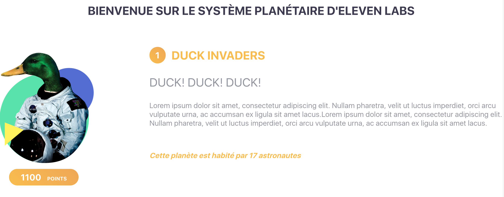

## Styliser ses composants

Il existe plusieurs moyens de rendre ses composants un peu plus jolis. Vous pouvez bien sûr les méthodes classiques avec du CSS, voir même du SCSS si vous en avez l'envie. Mais il est également possible de le faire en JS (le fameux CSS in JS) en utilisant des librairies comme Styled-components.

### La méthode CSS

Prenons un exemple simple avec notre composant `<Title />`. Créons dans le dossier components, un fichier `Title.css`.
Il est recommandé de split votre CSS, chaque fichier CSS étant relié au composant du même nom.

```css
/* Title.css */
.app-title {
    text-align: center;
    color: #F9BD4F;
}
```

Puis dans notre composant `Title.jsx`

```js
// Title.jsx

//On importe notre fichier
import './Title.css';

const TitlePage = ({ title = "Titre par défaut" }) => {
    // On ajoute une class à notre composant via la props className
    return <h1 className="app-title">{title}</h1>;
};
```

On peut très facilement styliser ses composants en ajoutant des classes. Si vous remarquez bien, en React, on utilise le mot-clé className puisque class est déjà utilisé par le DOM. Faites bien attention à cela.

### Inline style

Une autre méthode est le ***inline-style***, chaque composant React possède une propriété nommé `style`. Il suffit de lui injecter les différents styles CSS représentés sous forme d'un objet.

Par exemple:
```js
// Title.jsx
const TitlePage = ({ title = "Titre par défaut" }) => {
    // On ajoute la propriété style
    return <h1 className="app-title" style={{ color: '#3B3A4E', fontSize: '32px' }}>{title}</h1>
};
```

Le titre a désormais a une autre couleur ! Vous pouvez très bien allier les classes CSS et les objets style comme dans l'exemple, mais sachez que le contenu de l'objet Style est ***prioritaire***. 

L'intérêt du inline-style est de pouvoir gérer dynamiquement le style, puisque c'est un objet, vous pouvez le manipuler aisément en JS.

> Attention, les propriétés s'écrivent en camelCase.

### Styled-Components

La dernière méthode que je vais vous présenter est d'utiliser la librairie Styled-components ! C'est cette méthode là que nous utiliserons tout le long du tutoriel, la librairie est compatible React mais aussi [React-native](https://www.styled-components.com/docs/basics#react-native) !

La force de **Styled-components** est de pouvoir créer des composants minimalistes, purement orientés design en plus d'abstraire completement le CSS des fichiers JSX.
Si vous regardez bien les 2 premières méthodes, le composant `<TitlePage />` possède un className et du style, dans des grosses applications, cela peut très vite devenir lourd et illisible.

Commençons par installer la librairie:
```
yarn add styled-components
```

Nous allons créer notre premier composant stylisé, l'intérêt de **Styled-components** est de pouvoir nommer notre composant graphique par ce qu'il représente vraiment.
Créons un fichier `TitlePage.js`:

```js
import styled from 'styled-components';

const TitlePage = styled.h1`
  text-align: center;
  color: #3B3A4E;
  font-size: 42px;
`;

export default TitlePage;
```

Syntaxe étrange, n'est-ce pas? Un mix entre du JS et du CSS :p
Le principe est simple, chaque composant de styled-components représente un élément du DOM, une élément `h1` que l'on peut utiliser dans notre container App.js

```js
// on importe notre nouveau composant TitlePage
import TitlePage from './components/TitlePage';
/// ...
const App = () => {

/// ...
  return (
    <div className="App">
      <TitlePage>Bienvenue sur le système planétaire d'Eleven labs</TitlePage>
      {planets.map(planet => <Planet planet={planet} />)}
    </div>
  )
};
```
Et voilà! Si vous regardez votre navigateur, rien a changé et nous avons bien abstrait notre container App de tout styles ! En lisant notre JSX, celui-ci est totalement clair.

Dernière chose, il est possible d'injecter des props à nos composants provenant de styled-components.

On injecte une props `uppercase` à notre composant
```js
// on importe notre nouveau composant TitlePage
import TitlePage from './components/TitlePage';
/// ...
const App = () => {

/// ...
  return (
    <div className="App">
      <TitlePage uppercase>Bienvenue sur le système planétaire d'Eleven labs</TitlePage>
      {planets.map(planet => <Planet key={planet.id} planet={planet} />)}
    </div>
  )
};
```

Dans notre composant TitlePage,  on peut rajouter une condition qui, en fonction de la props, permet de mettre le titre en uppercase ou non !

```js
import styled from 'styled-components';
// components/TitlePage.js
const TitlePage = styled.h1`
  text-align: center;
  color: #3B3A4E;
  font-size: 42px;
  text-transform: ${props => props.uppercase ? "uppercase" : "none"};
`;
```

Niveau syntaxe, je vous invite à bien connaitre l'ES6 et la manipulation de string :)
Vous l'aurez compris, le fait d'ajouter des props, va permettre de modifier le design dynamiquement !

Vous pouvez supprimer l'ancien composant `Title.jsx` et `Title.css`, ils sont désormais inutiles!

### Stylisons notre composant Planet

Revenons désormais à notre composant <Planet /> pour mettre en pratique tout ce que nous avons appris dans cette étape.
Rappellez-vous également de notre interface, où j'avais découpé l'affichage des infos d'une planète. Il est temps de le suivre !

On a donc:
- un layout global
- un layout pour l'image + points
- un layout pour les infos
- l'image
- les points
- le nom
- la citation
- la description
- le nombre d'astronautes

#### Layout

Tout ce qui est Layout, on va pouvoir créer un composant dans `Container.js`:

```js
import styled from 'styled-components';

const Container = styled.div`
  display: flex;
  justify-content: space-between;
  flex-direction: ${props => props.row ? "row" : "column"};
  align-items: ${props => props.centered ? "center" : "normal"};
  margin: 3rem 0;
`;

export default Container;
```

Afin qu'il soit réutilisable, je lui ajouté quelques props pour qu'on puisse définir sa direction, s'il doit être centré, etc.

#### Les points

Pour tout ce qui est points (et donc chiffres), nous allons créer un composant Number. Si vous regardez la maquette, l'affichage des points et du classement est similaire.

```js
import styled from 'styled-components';

const Number = styled.div`
  background: linear-gradient(45deg, #F9BD4F, #EEA756);
  border-radius: 25px;   
  color: #FFFFFF;
  font-size: 24px;
  font-weight: bold;
  max-width: 130px;
  padding: 0.5rem ${props => props.compact ? "1rem" : "2rem"};
  text-align: center;
  margin-right: 1rem;
`;

export default Number;
```

Voici ce que donne le composant `<Planet />` après avoir incorporé tout les composants stylisés:

```jsx
// components/Planet.jsx

/// ...
import Unit from './Unit';
import Quote from './Quote';
import PlanetName from './PlanetName';
import Description from './Description';
import AstronautsTotal from './AstronautsTotal';
import PlanetImage from './PlanetImage';
import Container from './Container';
import Number from './Number';

const Planet = ({ planet, position }) => (
  <Container row>
    <Container centered>
      <PlanetImage alt="duck planet" src={planet.img} />
      <Number>{planet.points}<Unit>points</Unit></Number>
    </Container>
    <div>
      <PlanetName><Number compact>{position}</Number>{planet.name}</PlanetName>
      <Quote>{planet.citation}</Quote>
      <Description>{planet.description}</Description>
      <AstronautsTotal>{`Cette planète est habité par ${planet.totalAstronauts} astronautes`}</AstronautsTotal>
    </div>
  </Container>
);
```

On sait exactement ce que représente chaque information affichée. Je vous invite à tous les créer en vous aidant de la doc de [Styled-components](https://www.styled-components.com/docs), hésitez pas à modifier le style à votre convenance ;)

Voici ce que donne notre interface désormais !




> _**Avis Personnel**: Je sais que beaucoup de développeurs ont tendance à vouloir créer des composants le plus générique possible. <br>
Personnellement, je vous le déconseille. A vouloir faire trop générique, on peut très vite tomber dans des composants usines à gaz.<br><br>
Si vous regardez notre composant `<Planet />`, il est facile à lire et les props injectés aux composants stylisés sont clairs, définissent exactement ce qu'elles font et ce sont uniquement des conditions.<br><br>
Si vous injectez des props qui définissent des couleurs, des tailles, on se retrouve à définir les valeurs du style hors du composant lui-même et on perd tout l'intérêt. Alors restez simple. ;)_ <

On en a enfin fini avec cette étape ! Spoiler alert: On va créer un menu et naviguer entre les pages.

---
Retrouvez le code de l'étape 4 sur mon [Github](https://github.com/KizeRemi/Tutoriel-react/tree/step-4).

---
